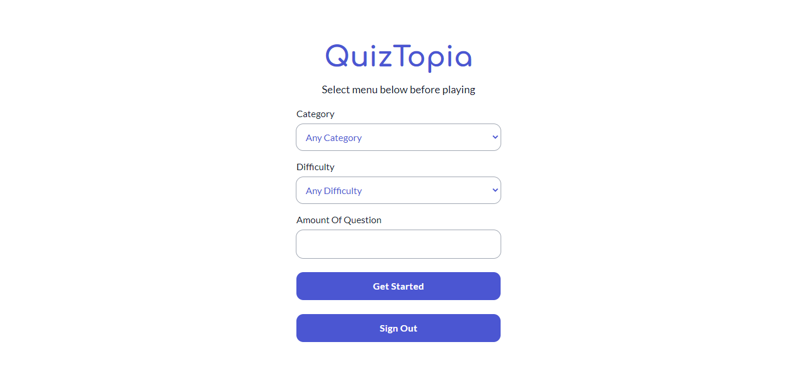

# QuizTopia

[](https://quiztopia-beta.netlify.app)

## Login to QuizTopia

Email : test@gmail.com
Password : testing

## Developing

Node.js `>= 16.x` setup with [yarn](https://yarnpkg.com/) is recommended.

```bash
# duplicate & fill environment file
cp .env.example .env.local

# install dependencies
yarn

# serve with hot reload at localhost:3000
yarn start

# build for production
yarn build
```

## Built with

- Framework - [**ReactJS**](https://reactjs.org/)
- Styling - [**Tailwind CSS**](https://tailwindcss.com/)
- Fonts - [**GoogleFonts**](https://fonts.google.com/)
- Icons - [**ReactIcons**](https://react-icons.github.io/react-icons/)
- Data Fetching - [**Axios**](https://axios-http.com/)
- State Management - [**Redux**](https://redux-toolkit.js.org/)
- Cliend Side Routing - [**ReactRouterDOM**](https://reactrouter.com/)
- User Authentication - [**Firebase**](https://firebase.google.com/)
- Package Manager - [**Yarn**](https://yarnpkg.com/)
- Linter - [**Eslint**](https://eslint.org/)
- Code Formatter - [**Prettier**](https://prettier.io/)
- Deploy - [**Netlify**](https://www.netlify.com/)
- Others
  - Encode HTML Entities - [**html-entities**](https://github.com/mdevils/html-entities)
  - Loader - [**react-loader-spinner**](https://mhnpd.github.io/react-loader-spinner/)
